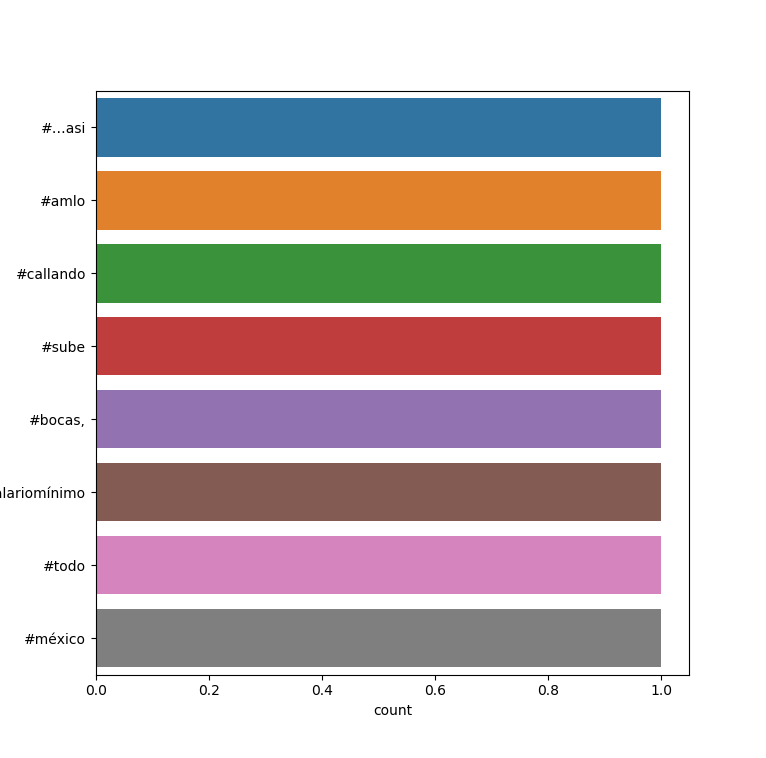
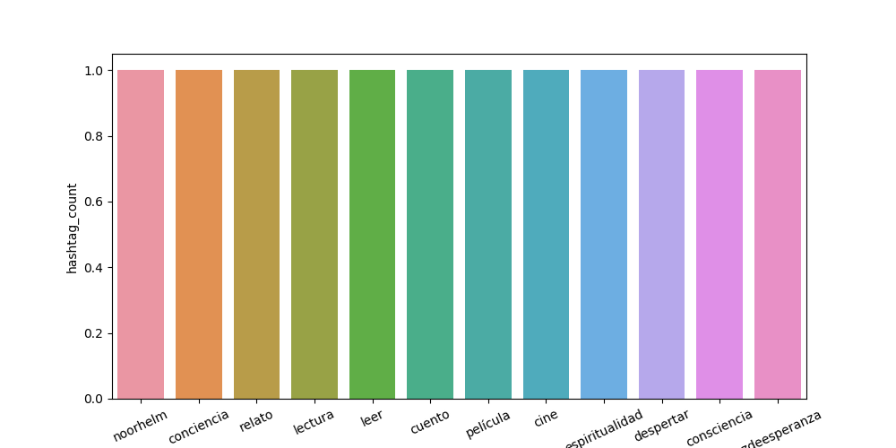

# Twitter_Spark
Spark Streaming using Twitter API

:+1: :sparkles: :camel: :tada: :rocket: :metal: :octocat: 

Proyecto para la materia de Bases de Datos No Relacionales

## Directorio
Archivo | Función
------------ | -------------
ReadTweets.py | Recibe los tweets y manda al socket el texto del tweet 'limpio'
hashtags.py | Similar a ReadTweets.py pero manda el hashtag del tweet
SparkSTR.py, spark_hashtags.py | Inicia Spark, trabaja los datos del socket y grafica

## Instrucciones
Configurar las API Keys que proporciona Twitter

Para correr cualquiera de las dos diferentes consultas, basta con ejecutar los bats adjuntos:
Si se desea correr la búsqueda por palabras:
1. 1_tweets.bat
2. 2_spark.bat

Si se desea correr la búsqueda por tendencias:
1. 3_trending_topics.bat
2. 3_spark_tt.bat

## Resultados

